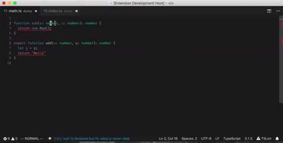

## Status Bar Error
---
Visual Studio Code extensions that will display the linter message of the current active line in the status bar.



### Install
---
Install [StatusBarError](https://marketplace.visualstudio.com/items?itemName=JoeBerria.statusbarerror) from the Visual Studio Code extension gallery.

### Options
---
You can change the color of the font for Errors, Warnings, Info and Hints. You can change the message unicode icon for the different messages.

```json
{
  "statusbarerror.color.error": "#ff0000",
  "statusbarerror.icon.error": "🛑",

  "statusbarerror.color.info": "#00ff00",
  "statusbarerror.icon.info": "🔥",
  ...
}
```

### Contribute
---
StatusBarError's [repository](https://github.com/nexes/statusbar-error.git) is here.
